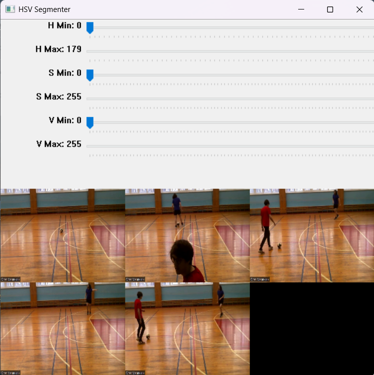

# Soccer Video Analytics

A cutting-edge **computer vision** pipeline for analyzing soccer footage via a **custom YOLOv8 model**. The system detects, tracks, and projects key soccer entities (ball, players, audience) onto a top-down layout, while providing advanced analytics such as **scores, ball possession time, CSV logs,** and **heatmaps** for in-depth tactical insights.


---

## Table of Contents

1. [Overview](#overview)  
2. [Key Features](#key-features)  
3. [Requirements](#requirements)  
4. [Installation](#installation)  
5. [Quick Start](#quick-start)  
6. [Configuration](#configuration)  
7. [Outputs](#outputs)  
   - [Analytics](#analytics)  
   - [Homography](#homography)  
   - [Heatmap](#heatmap)  
8. [Future Improvements](#future-improvements-optional)  
9. [License](#license)

---

## Overview

This repository implements a highly modular system capable of:

- **Detection**: Powered by **YOLOv8** (four classes: soccer ball, player A, player B, audience).
- **Analytics**: Tracks scoring events (goal polygon), ball possession per team, and logs data to CSV/JSON.
- **Homography**: Transforms positions from camera view to a top-down field layout.
- **Heatmaps**: Shows player distribution over the field, highlighting hotspots of activity.

**Use Cases**:  
- *Coaches* wanting advanced match analytics.  
- *Broadcasters* adding real-time possession stats.  
- *Researchers* studying movement patterns.

---

## Key Features

1. **Interactive HSV Segmentation**  
   - Tailor color ranges for each team’s uniform, ensuring reliable color-based classification.  
   - Press **`y`** once satisfied with each color range.

2. **Scoring with Goal Polygon**  
   - Draw a polygon to define the goal area on the first frame.  
   - The system automatically increments the team’s score if the ball enters that polygon.

3. **Ball Possession Calculation**  
   - Infers ball “ownership” by checking overlaps with a player’s bounding box bottom region.  
   - Logs how many seconds each team has possession, shown live in the main video.

4. **Homography-Based Layout Video**  
   - Projects all entities (ball, players) into a 2D top-down “coach view.”  
   - Output: `layout_video.mp4`.

5. **Heatmaps per Team**  
   - Aggregates each team’s movement, generating `heatmap_video_<team>.mp4` and final `.png` images.  
   - Identifies “hot zones” for strategic analysis.

---

## Requirements

- **Python 3.12**
- **CUDA 11.8** (if you plan to use GPU acceleration)
- **PyTorch 2.5.1** or compatible
- **Key Libraries**:
  - `opencv-python`
  - `numpy`
  - `pyyaml`
  - `ultralytics` (includes YOLOv8)
  - `tqdm`

---

## Installation

1. **Clone** the repository:
   ```bash
   git clone https://github.com/Tony-Luna/soccer-video-analytics.git
   cd soccer-video-analytics
   ```

2. **Create and activate** a conda environment (recommended):
   ```bash
   conda create -n soccer-env python=3.12 -y
   conda activate soccer-env
   ```

3. **Install OpenCV, NumPy, PyYAML, Ultralytics, TQDM**:
   ```bash
   pip install opencv-python numpy pyyaml ultralytics tqdm
   ```

4. **Install PyTorch (2.5.1) + CUDA 11.8**:
   ```bash
   pip install torch torchvision torchaudio --index-url https://download.pytorch.org/whl/cu118
   ```
   Or see [PyTorch’s official instructions](https://pytorch.org/get-started/locally/) if you need a different version or environment.

---

## Quick Start

1. **Set up your `config.yaml`**:
   - `input_video_path`: e.g., `"C:/videos/soccer_clip.mp4"`
   - `input_layout_image`: e.g., `"C:/images/soccer_field_layout.png"`
   - `yolo_model_path`: e.g., `"./models/yolov8-soccer-demo.pt"`

2. **Run**:
   ```bash
   python main.py
   ```

3. **On-Screen Prompts**:

   - **HSV Setup Window**  
      
      
     Use trackbars to isolate each team’s uniform color. Press **`y`** once satisfied.

   - **Homography Selection**  
       
     Click corresponding points on the field layout (left) and video frame (right). Press **`y`** when you have at least four point pairs.

   - **Goal Polygon**  
       
     Click points around the goal, press **`y`** to finalize. The system uses this polygon to detect scoring.

4. **Outputs** will appear in:
   ```
   <output_base_dir>/<video_name>/
   ```
   containing videos, CSV logs, JSON reports, and heatmaps.

---

## Configuration

A sample `config.yaml`:

| Section                           | Parameter            | Type     | Description                                                                               |
|-----------------------------------|----------------------|---------|-------------------------------------------------------------------------------------------|
| **usage_parameters**              | `input_video_path`   | string  | Path to your soccer video                                                                 |
|                                   | `output_base_dir`    | string  | Base directory to store outputs                                                           |
|                                   | `n_classes`          | int     | Number of HSV classes (teams)                                                             |
|                                   | `player_labels`      | list    | YOLOv8 class indices for players                                                          |
|                                   | `ball_labels`        | list    | YOLOv8 class indices for the ball                                                         |
|                                   | `verbosity`          | int     | Logging level: 0=WARNING, 1=INFO, 2=DEBUG                                                 |
| **detection_parameters**          | `yolo_model_path`    | string  | Path to the YOLOv8 weights                                                                |
| **homography_parameters**         | `input_layout_image` | string  | Path to a top-down field image for manual homography                                      |

---

## Outputs

After processing, you will see these key outputs:

### Analytics

- **Scores**: Incremented automatically when the ball enters the goal polygon.  
- **Ball Possession**: Tracked in real time, displayed in `scores_video.mp4` (top-left corner) for scoring, top-right for possession.
- **CSV Logs**: Per-frame data in `soccer_analytics.csv` (e.g., positions, last ball possession).  
- **JSON Report**: `soccer_analytics_report.json` consolidating final scores and total possession time.

### Homography

- **layout_video.mp4**: Overhead perspective. Each frame shows player icons and ball location mapped to the field layout.  
- Ideal for strategic analysis (tactics, spacing, coverage).


### Heatmap

- **heatmap_video_<team_letter>.mp4** for each team’s on-field distribution over time.  
- **heatmap_image_<team_letter>.png** for a final snapshot of the highest-density zones.


---

## Future Improvements

- **Automated Goal Detection**: Let the system detect the goal polygon automatically.  
- **Multi-Camera Merging**: Combine data from multiple angles into one overhead perspective.  
- **Individual Player Tracking**: Extend to track unique players, not just color-based classification.

---

## License

This project is licensed under the **AGPL-3.0**. See [LICENSE](LICENSE) for details. If you distribute a modified version of this code, you must make the source publicly available under the same license.

---

**Thank you for using Soccer Video Analytics!** If you have questions or improvements, feel free to open issues or pull requests.